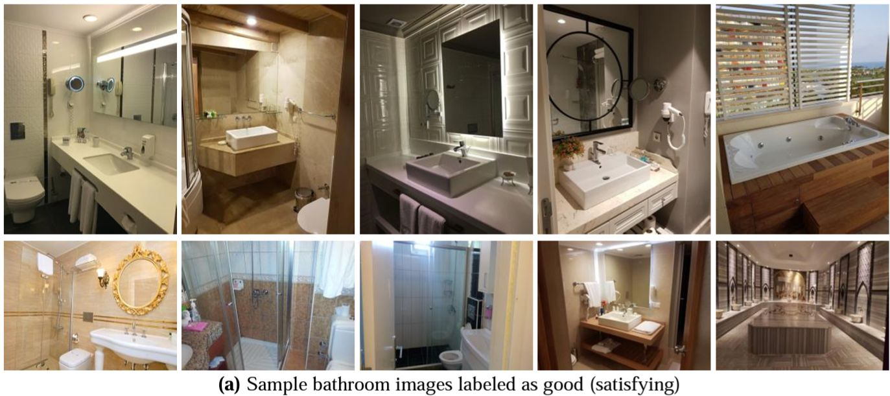
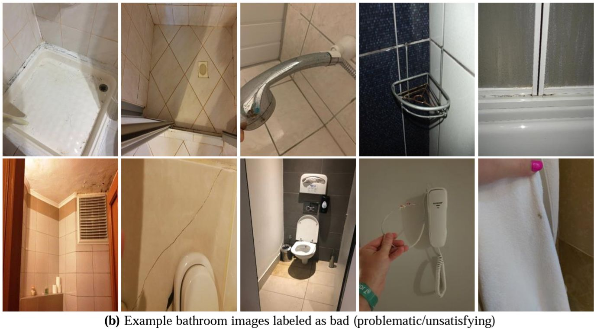
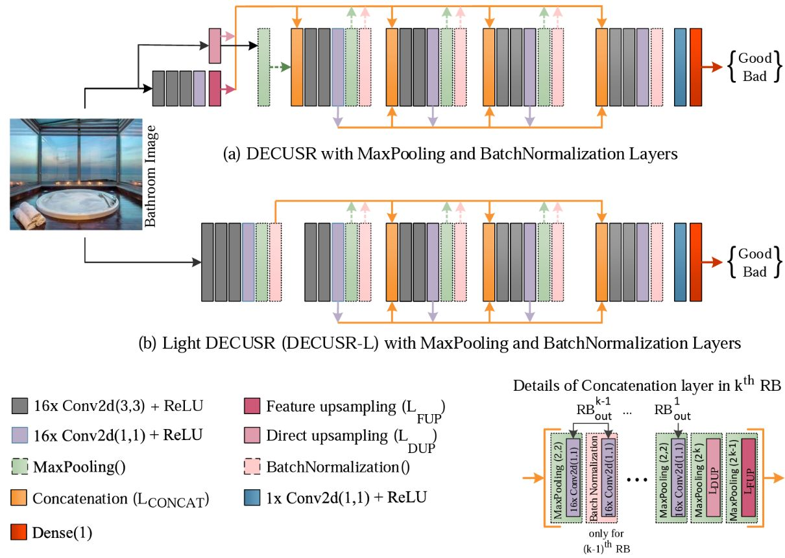

# hotel-bathroom-classification

Repository for supporting files and outcomes for my paper entitled
[Automatic and Accurate Classification of Hotel Bathrooms from Images with Deep Learning](https://dergipark.org.tr/en/download/article-file/2823031)
published in 
[International Journal of Engineering Research and Development](https://dergipark.org.tr/en/pub/umagd) journal.

Please cite the paper as follows:

*Temiz, Hakan. "Automatic and Accurate Classification of Hotel Bathrooms from Images with Deep Learning.
" International Journal of Engineering Research and Development 14.3 (2022): 211-218.* 

&nbsp;

## Overview

&nbsp;

## Dataset

The images were downloaded from [TripAdvisor](https://www.tripadvisor.com). In total, 11,116 images were manually
labelled as `good` or `bad`. 10,561 images were separated for training, and 555 images for testing.

7181 bathroom images were classified as good and 3935 images as bad. Of the good and bad images,
6822 and 3739 were reserved for training, and 359 and 196 were reserved for testing, respectively.

This dataset is shared with the community with the name [HotelBath](https://zenodo.org/record/7340428) in Zenodo

(~435MB). 

Details of the dataset:

||Good|Bad|**Total**|
|--|--|--|--|
|Training|6822|3739|10561|
|Test|359|196|555|
|**Total**|7181|3935|11116|

Some sample images that labelled as `good`

Some sample images that labelled as `bad`

&nbsp;

## Algorithms
In order to classify hotel bathrroms, two deep convolutional network was used: DECUSR and DECUSR-L.
DECUSR is originially designed to super-resolve 1-channel ultrasound B-mode images. A Dense (fully connected)
layer is added on the top of the algorithm to adap the model for classification problem. Since, the problem
is a type of binary classification, Sigmoid activation is used in this layer.

DECUSR-L is a some sort of light version of originial DECUSR model. In this light version, feature extraction
block, Direct Upsampling and Feature Upsampling  layers are removed. The rest of 

## Training

## Evaluation

The following metrics were used for the evaluation of the classification performance:

**True Positive (TP):** Values that are actually positive and predicted positive.

**False Positive (FP):** Values that are actually negative but predicted to be positive.

**False Negative (FN):** Values that are actually positive but predicted to be negative.

**True Negative (TN):** Values that are actually negative and predicted to be negative.

**Accuracy:** The ratio of all correctly predicted positives and negatives. It is defined as follows:
$$\frac{TP + TN}{TP + TN + FP + FN}$$

**Precision:** The ratio of the number of correctly predicted positives to all predicted positives.
It is a measure of how many of those predicted positively are actually correct.
$$\frac{TP}{TP + FP}$$

**Recall:** The ratio of the number of correctly predicted positives to the true positives.
It is a measure of how many of the true positives are correctly predicted. Also known as specificity.
$$\frac{TP}{TP + TN}$$

**TPR** True positive rate. It is another synonym for Recall and is defined in the same way as the Recall given above.

**FPR** False positive rate. The ratio of the number of falsely predicted positives to the true negatives.
Also called the probability of a false alarm.
$$\frac{FP}{FP + TN}$$

**AUC** Area under the receiver operating characteristic (ROC) curve. 
AUC measures the entire two-dimensional ROC curve which is calculated over the ratio
of TPR to FPR for all possible classification thresholds. 
The closer to 1.0, the higher the classification excellence.

&nbsp;

Please feel free to contact me at [htemiz@artvin.edu.tr](mailto:htemiz@artvin.edu.tr) for any further information.

