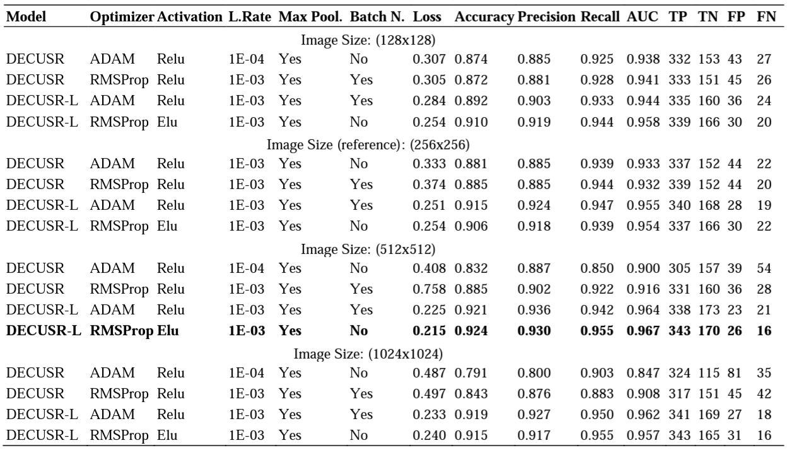

# hotel-bathroom-classification

Repository for supporting files and outcomes for my paper entitled
[Automatic and Accurate Classification of Hotel Bathrooms from Images with Deep Learning](https://dergipark.org.tr/en/download/article-file/2823031)
published in 
[International Journal of Engineering Research and Development](https://dergipark.org.tr/en/pub/umagd) journal.


Please cite the paper as follows:

*Temiz, Hakan. "Automatic and Accurate Classification of Hotel Bathrooms from Images with Deep Learning.
" International Journal of Engineering Research and Development 14.3 (2022): 211-218.*
[https://doi.org/10.29137/umagd.1217004](https://doi.org/10.29137/umagd.1217004)

&nbsp;

## Overview

Hotel bathrooms are one of the most important places in terms of customer satisfaction, 
and where the most complaints are reported. To share their experiences, guests rate hotels, 
comment, and share images of their positive or negative ratings. An important part of the room images
shared by guests is related to bathrooms. Guests tend to prove their satisfaction or dissatisfaction
with the bathrooms with images in their comments. These Positive or negative comments and 
potentially affect the prospective guests. In this study, two different versions of a deep learning 
algorithm were designed to classify hotel bathrooms as satisfactory (good) or unsatisfactory
(bad, when any defects such as dirtiness, deficiencies, malfunctions were present) by analyzing images.

The results revealed that the designed model(s) is very successful in automatically detecting situations
that may cause problematic or negative interpretations from the images.

&nbsp;

## Dataset

The images were downloaded from [TripAdvisor](https://www.tripadvisor.com). In total, 11,116 images were manually
labelled as `"good"` or `"bad"`. 10,561 images were separated for training, and 555 images for testing.

7181 bathroom images were labelled as `"good"` and 3935 images as `"bad"`. Of the images labelled `"good"`, 6822 were reserved 
for training and 359 for testing. Similarly, of the `"bad"` images, 3739 were reserved for training and 196 for testing.


This dataset, so-called [HotelBath](https://zenodo.org/record/7340428), is shared with in Zenodo
[](https://doi.org/10.5281/zenodo.7340428)
(~435MB). 

Details of the dataset:

||Good|Bad|**Total**|
|--|--|--|--|
|Training|6822|3739|10561|
|Test|359|196|555|
|**Total**|7181|3935|11116|

Some sample images that labelled as `"good"`


Some sample images that labelled as `"bad"`


&nbsp;

## Algorithms
In order to classify hotel bathrooms, two deep convolutional network was used: DECUSR and DECUSR-L.
DECUSR is originally designed to super-resolve 1-channel (grayscale) ultrasound B-mode images. A Dense (fully connected)
layer is added on the top of the algorithm to adapt the model for classification problem. Since the problem
is a type of binary classification, Sigmoid activation is used in this layer. The algorithms are implemented with `Keras`

DECUSR-L is a some sort of light version of originial DECUSR model. In this light version, feature extraction
block, Direct Upsampling and Feature Upsampling  layers are removed. 


## How to Run
Entire program reside in `"models"` folder. Both algorithms are run via `run.py` file. This module imports either
of the model which are the derived class from the class `My_Model` defined in `abstract_model`.py file.

To run the experiment, issue the following command in command prompt 
after making sure the desired model (DECUSR or DECUSR-L) is imported in `run.py`  

```python.exe run.py```

Should you need to use the models, the weights ensuring the highest performance for each one are located in
the `weights` folder. 

```python
from importlib import import_module

Module = import_module('Decusr_4RB_light') # provide full path in case module is not in the same folder
DECUSR_L = Module.My_Model(name='temp', training_path=folder_train, test_path=test_path)

DECUSR_L.model.load_weights('weights/Decusr_4RB_light.h5') # model is stored in the class as a member with name of 'model' 

DECUSR_L.model.predict(test_ds,)
...
```
The class `My_Model` provides many functions for several operations such as training, test, prediction, plotting, 
calculation of many metrics, ROC curves, Precision-Recall curves, etc. Please refer to the class for further details.

In addition, the `__get_model__` member method of the class can also be used to get the model itself.

```python
decusr_l_model = DECUSR_L.__get_model__(mode='test') # mode=test for testing (prediction)
decusr_l_model.load_weights('weights/Decusr_4RB_light.h5') # load pre-trained weights
decusr_l_model.predict(test_data) # do prediction for some test_data
```


## Training

The optimal hyper-parameter set ensuring the highest performance for each model
was found through a two-phased process. In the first stage,all combinations 
of several hyper parameters with several values were examined to find the best-two hyper-parameter set.
In search process the following alternatives were examined: three different optimizer, six activation function,
two learning rate, and whether the Max Pooling and Batch Normalization were applied or not.

The input image size was taken 256x256 pixels in the search process. 

In the second stage, each model was re-trained with the top two hyper-parameter sets for other images sizes:
128x128, 512x512 and 1024x1024 pixels.

Finally, DECUSR-L ensured the highest score (92.4% Accuracy) with the following settings:

- Optimizer: RMSProp
- Learning Rate: 1E-3
- Image Size: 512x512 pixels
- MaxPooling: Applied
- Batch Normalization: Not Applied


The optimal hyper-parameter setting for DECUSR (88.5% Accuracy) with the following settings:

- Optimizer: RMSProp
- Learning Rate: 1E-3
- Image Size: 256x256 pixels
- MaxPooling: Applied
- Batch Normalization: Applied


Entire experiment is illustrated in the figure below:


## Evaluation

The following metrics were used for the evaluation of the classification performance:

**True Positive (TP):** Values that are actually positive and predicted positive.

**False Positive (FP):** Values that are actually negative but predicted to be positive.

**False Negative (FN):** Values that are actually positive but predicted to be negative.

**True Negative (TN):** Values that are actually negative and predicted to be negative.

**Accuracy:** The ratio of all correctly predicted positives and negatives. It is defined as follows:
$$\frac{TP + TN}{TP + TN + FP + FN}$$

**Precision:** The ratio of the number of correctly predicted positives to all predicted positives.
It is a measure of how many of those predicted positively are actually correct.
$$\frac{TP}{TP + FP}$$

**Recall:** The ratio of the number of correctly predicted positives to the true positives.
It is a measure of how many of the true positives are correctly predicted. Also known as specificity.
$$\frac{TP}{TP + TN}$$

**TPR** True positive rate. It is another synonym for Recall and is defined in the same way as the Recall given above.

**FPR** False positive rate. The ratio of the number of falsely predicted positives to the true negatives.
Also called the probability of a false alarm.
$$\frac{FP}{FP + TN}$$

**AUC** Area under the receiver operating characteristic (ROC) curve. 
AUC measures the entire two-dimensional ROC curve which is calculated over the ratio
of TPR to FPR for all possible classification thresholds. 
The closer to 1.0, the higher the classification excellence.

Entire results are given below:



&nbsp;

Please feel free to contact me at [htemiz@artvin.edu.tr](mailto:htemiz@artvin.edu.tr) for any further information.


